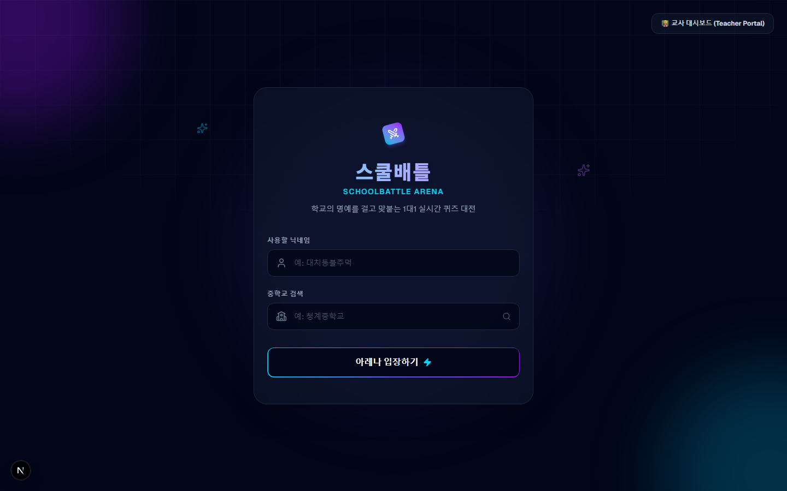
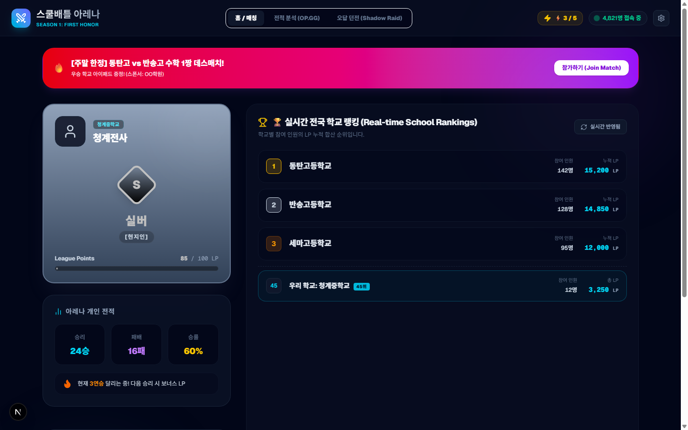
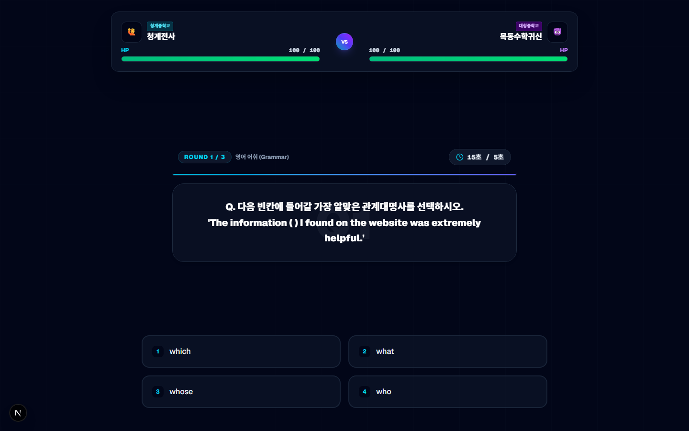
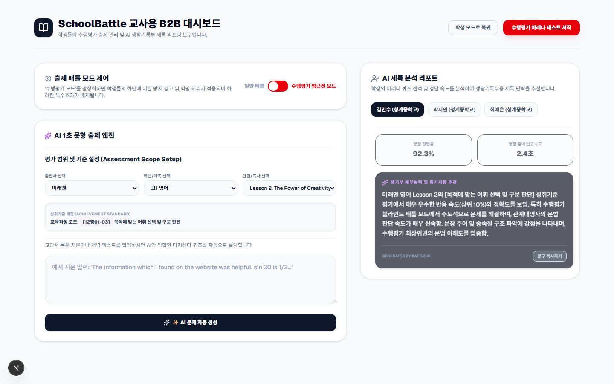
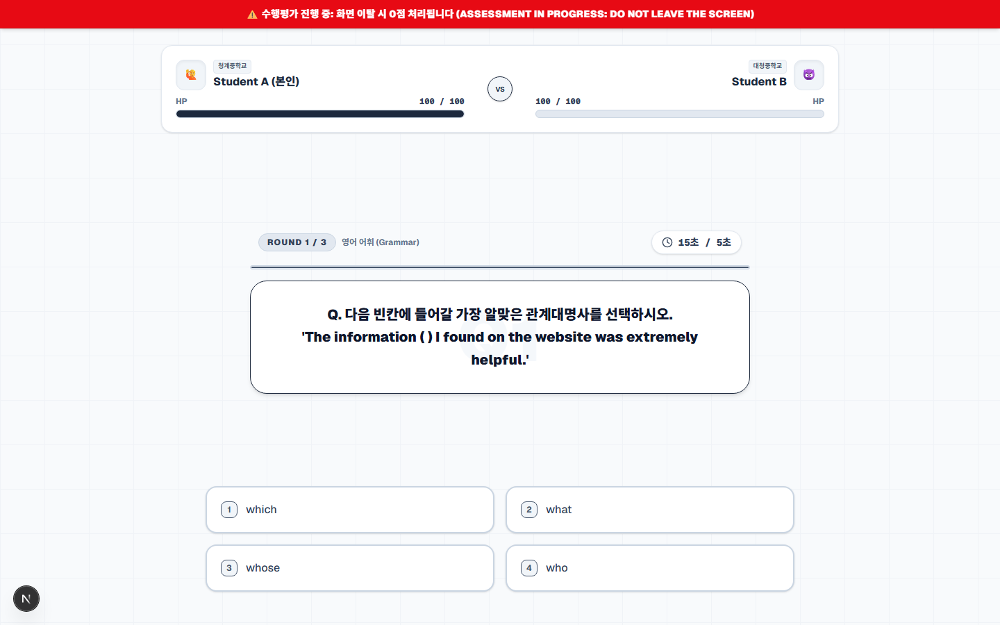
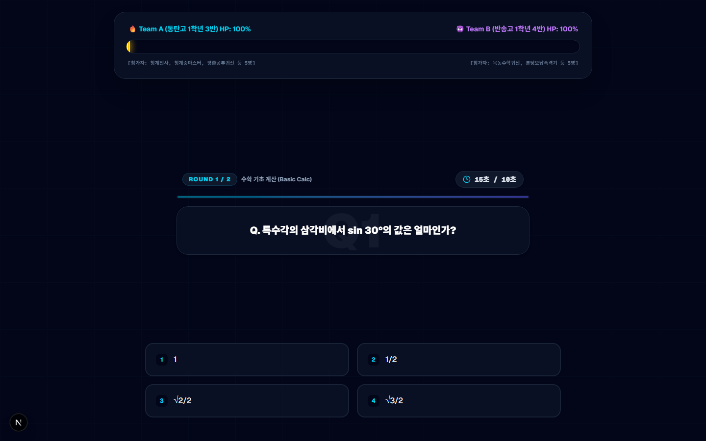

# 스쿨배틀 (SchoolBattle Arena)

> 📖 **[온라인 학습 뷰어 바로가기 (GitHub Pages)](https://yunha2604-hub.github.io/battle-study/)**  
> 심사위원 질의응답 100% 방어 가이드 및 인터랙티브 암기 연습 뷰어

학교를 대표해 전국 학생들과 맞붙는 실시간 퀴즈 배틀 서비스입니다.

친구들과 게임을 할 때는 밤을 새워도 등급을 올리려 합니다.
스쿨배틀은 그 집중력을 공부로 끌어옵니다.

---

## 왜 만들었나

| 대상 | 문제 |
|---|---|
| 학생 | 혼자 하는 공부는 금방 질린다. 게임처럼 경쟁 상대가 있으면 다르다. |
| 교사 | 퀴즈 출제, 채점, 생기부 세특 작성까지 쌓이면 수업 준비할 시간이 없다. |

---

## 무엇을 만들었나

학생용 모바일 앱과 교사용 PC 웹이 실시간으로 연동되는 교육 서비스입니다.

- 학생은 쉬는 시간에 타 학교 학생과 1:1 퀴즈 배틀 → 내 점수가 학교 순위에 실시간 반영
- 선생님은 교과서 지문을 붙여넣으면 AI가 1초 만에 퀴즈 생성 → 평가 후 세특 초안 자동 출력

---

## 시제품 화면

<table>
  <tr>
    <td align="center">
      <br/>
      <b>아레나 입장 화면</b><br/>
      닉네임 + 학교만 입력하면 1초 만에 배틀 시작
    </td>
    <td align="center">
      <br/>
      <b>전국 학교 랭킹 로비</b><br/>
      내 학교 순위를 실시간으로 확인하는 대기 화면
    </td>
  </tr>
  <tr>
    <td align="center">
      <br/>
      <b>1:1 배틀 아레나</b><br/>
      10초 안에 맞히면 상대 점수를 깎는 실시간 대결
    </td>
    <td align="center">
      <br/>
      <b>선생님 관리자 화면</b><br/>
      교과서 지문 붙여넣기 → 퀴즈 자동 생성 + 세특 초안 출력
    </td>
  </tr>
  <tr>
    <td align="center">
      <br/>
      <b>수행평가 엄근진 모드</b><br/>
      다른 창을 열면 즉시 실격 처리되는 부정행위 방지 화면
    </td>
    <td align="center">
      <br/>
      <b>단체 점수 줄다리기</b><br/>
      반 전체가 동시에 풀며 점수를 겨루는 학교 대항전
    </td>
  </tr>
</table>

---

## 기능 정리

### 학생용 앱
| 기능 | 설명 |
|---|---|
| 실시간 1:1 배틀 | 실력이 비슷한 타 학교 학생과 즉시 매칭 |
| 전국 학교 랭킹 | 내 점수가 학교 순위에 합산돼 소속감과 성취감을 느낄 수 있음 |
| 오답 던전 | 번개(입장권)가 떨어지면 틀렸던 문제를 풀어야 다시 충전됨 |
| 등급 칭호 | [오답 자판기]부터 [생태계 교란종]까지 승리할수록 칭호가 올라감 |

### 교사용 웹
| 기능 | 설명 |
|---|---|
| 퀴즈 자동 생성 | 교과서 지문 붙여넣기 → AI가 오답 선지 포함 퀴즈를 1초 만에 완성 |
| 수행평가 엄근진 모드 | PIN 코드로 학생 접속, 게임 효과 제거 + 익명화 + 부정행위 감지 |
| 세특 초안 출력 | 학생별 오답 기록을 분석해 생기부에 바로 붙여넣을 수 있는 문구 생성 |

---

## 지원 교과목

학생들의 학습 비중이 가장 높고 몰입과 경쟁 동기가 뚜렷한 중·고등학교 핵심 3대 교과(**국어·영어·수학**)를 중심으로 구성되어 있습니다. 각 과목의 문제 특성에 맞춰 5초~90초의 차등 제한 시간을 적용해 속도감 있는 퀴즈 배틀을 제공합니다.

| 교과목 | 주요 출제 영역 | 문제 유형 및 제한 시간 특징 |
|---|---|---|
| **국어 (Korean)** | 한글 맞춤법, 어문 규정, 근현대 문학 | 10~15초 숏폼 퀴즈 위주, 순간 어문 규정 및 문학 상식 확인 |
| **영어 (English)** | 필수 어휘(Vocab), 핵심 문법(Grammar), 구문 독해(Syntax) | 5~30초 제한 시간, 신속한 독해력과 어휘 판별력 측정 |
| **수학 (Math)** | 기초 연산, 삼각비, 다항식/방정식 (보스 배틀) | 10초(기초 계산) ~ 90초(보스 배틀 고난도) 난이도별 차등 배정 |

- **교육과정 및 성취기준 연동**: 교사용 웹에서는 2022 개정 교육과정 성취기준 코드(예: `12영01-05`, `12수01-02`, `12국01-02`) 및 주요 교과서 출판사(미래엔, 천재교육, 비상, EBS, YBM)와 연계되어 교과서 지문 기반 문제 출제 및 생기부 세특 문구 생성을 지원합니다.
- **확장성**: 현재 국·영·수 핵심 과목을 중심으로 구축되었으며, 개념 확인형 퀴즈 출제가 용이한 사회·역사(한국사)·과학 등 탐구 영역으로 확장이 가능합니다.

---

## 기술 스택

- **Framework**: [Next.js 16](https://nextjs.org/) (App Router, Turbopack)
- **Library**: [React 19](https://react.dev/), [TypeScript](https://www.typescriptlang.org/)
- **Styling**: [Tailwind CSS v4](https://tailwindcss.com/)
- **Animation & Icons**: [Framer Motion](https://motion.dev/), [Lucide React](https://lucide.dev/)

---

## 시작하기 (실행 방법)

별도의 백엔드나 환경변수 설정 없이 바로 실행할 수 있는 프로토타입 웹 애플리케이션입니다.

### 1. 사전 요구사항
- **Node.js** 20.x 이상 권장
- **npm** (또는 yarn, pnpm)

### 2. 패키지 설치
```bash
npm install
```

### 3. 개발 서버 실행
```bash
npm run dev
```
실행 후 웹 브라우저에서 [`http://localhost:3000`](http://localhost:3000)으로 접속합니다.

### 4. 빌드 및 프로덕션 실행
```bash
# 프로덕션 빌드
npm run build

# 프로덕션 서버 실행
npm start
```

### 5. 코드 검사 (Lint)
```bash
npm run lint
```

---

## 기존 서비스와 다른 점

| 비교 | 기존 서비스 | 스쿨배틀 |
|---|---|---|
| 스마트 학습지 | 혼자 풀다 보면 금방 질림 | 친구들과 승부하니까 계속 하게 됨 |
| 카훗(Kahoot) | 수업 끝나면 참여도 끝 | 방과 후에도 학생들이 자발적으로 들어옴 |
| 일반 교육 앱 | 문제 출제·검수에 많은 비용 | AI로 자동 생성해서 비용이 거의 없음 |

---

## 앞으로

우선 청계중학교에서 시작해 주변 학교로 퍼뜨릴 생각입니다.
학교가 많이 참여할수록 전국 랭킹 대결이 더 재밌어지기 때문에,
한 학교가 쓰기 시작하면 경쟁 학교도 따라오는 구조입니다.

비싼 학원을 다니지 않아도, 스마트폰 하나로 전국 친구들과 경쟁하며 공부할 수 있는 것 —
그게 이 서비스를 만든 이유입니다.

---

*청계중학교 3학년 박윤하 · 2026 전국 중학생 창업아이디어 경진대회 출품작*
