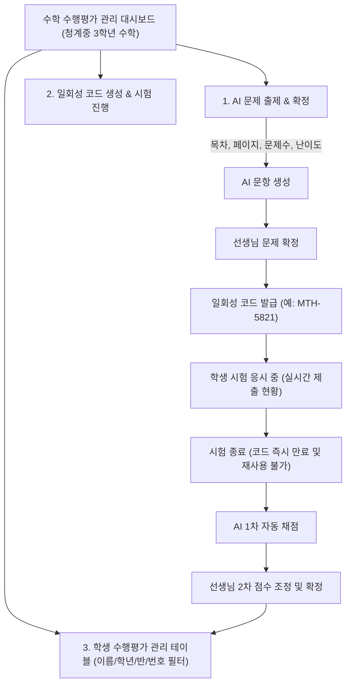

# [구현 계획] 수학 수행평가 관리 전용 교사용 대시보드 (MVP)

사용자 피드백을 반영하여 **세특 관련 내용을 전면 삭제**하고, `docs/teacher.txt` 요구사항에 맞춰 **"수학 과목 전용 수행평가 관리"**에만 100% 집중하도록 대시보드를 재구성한 MVP 구현 계획입니다.

---

## 🎯 핵심 변경 방향 (세특 삭제 & 수행평가 관리 중심 전환)

1. **세특 관련 요소 완전 제거**:
   - 생기부 세특 분석 리포트, 추천 문장, NEIS 복사 버튼 등 세특 관련 기능 일체 삭제.
2. **수행평가 관리 전용 테이블로 재구성**:
   - 기존의 세특 조회용 학생 목록을 **"수행평가 응시 현황 및 채점 관리 테이블"**로 변경.
   - **이름, 학년, 반, 번호** 컬럼 구성 및 **각 컬럼별 검색/필터링** 기능 제공.
3. **수학 과목 단독 고정**:
   - 다과목 선택 UI 제거 → **중3 수학과(Mathematics) 교사 전용** 환경으로 고정.
4. **수행평가 End-to-End 라이프사이클 구현**:
   - **[1단계] AI 문항 출제**: 목차, 페이지, 문제 수, 난이도 입력 → AI 출제 → 선생님 문제 확정
   - **[2단계] 일회성 코드 배포**: 확정 후 일회성 코드(PIN) 생성 → 학생 응시 진행 → 시험 종료 시 코드 만료(재사용 불가)
   - **[3단계] 2단계 평가**: 학생 제출 답안에 대해 **AI 1차 자동 채점** → **선생님 2차 점수 조정 및 확정**

---

## 📐 대시보드 화면 구조 및 기능 흐름 (MVP)

---

## 🛠️ 상세 컴포넌트 설계 (`TeacherDashboard.tsx`)

### 1. 상단 헤더 & 현황 요약
- **타이틀**: `청계중학교 3학년 수학과 수행평가 관리 대시보드` (수학 과목 단독 고정)
- **수행평가 현황 카드**:
  - 현재 평가명 (예: `2026학년도 1학기 1차 수학 수행평가 - 제곱근과 실수`)
  - 응시 현황: `28명 / 28명 완료 (100%)`
  - 학급 평균 점수: `84.5점 / 100점`
  - 채점 상태: `AI 1차 완료 (28명), 교사 2차 확정 대기 (3명)`

### 2. [기능 ①] AI 수학 수행평가 출제 & 문제 확정
- **입력 폼**:
  - **교과서 단원(목차)**: `I. 실수와 그 연산` / `II. 다항식의 곱셈과 인수분해` / `III. 이차방정식` / `IV. 삼각비`
  - **교과서 페이지**: 예) `p.12 ~ p.35`
  - **문제 수**: `3문항 (약식)`, `5문항 (기본)`, `10문항`
  - **난이도**: `기본(하)`, `표준(중)`, `심화(상)`
- **출제 및 확정**:
  - `[AI 수행평가 문항 생성]` 클릭 시 수학 문제 및 정답/풀이과정 자동 생성
  - 생성된 문제를 확인하고, 문항별 점수 배점(예: 20점씩) 확인
  - **`[수행평가 문제 확정]`** 버튼을 누르면 시험 코드 생성 단계로 전환

### 3. [기능 ②] 일회성 시험 코드 배포 & 만료 관리
- 문제 확정 후 **`[일회성 시험 코드 생성]`** 클릭
- 대형 핀코드 표시: 예) **`MTH-7429`** (학생들에게 프로젝터로 안내 가능)
- **시험 진행 컨트롤**:
  - `시험 시작 (코드 활성화)`: 학생들이 해당 코드로 시험 접속 가능
  - 실시간 제출 시뮬레이션: 제출 완료 학생 수 실시간 증가
  - **`[시험 종료 및 코드 만료]`** 버튼:
    - 클릭 시 해당 코드는 **'만료됨(EXPIRED)'** 상태로 변경
    - "이 일회성 코드는 시험이 종료되어 다시 사용할 수 없습니다." 경고 배지 표시

### 4. [기능 ③] 학생 수행평가 관리 테이블 (요구사항 1번)
- **테이블 구성 컬럼**:
  - `학년` (3학년)
  - `반` (1반, 2반, 3반)
  - `번호` (1번 ~ 30번)
  - `이름` (김민수, 박지민, 최예은, ...)
  - `제출 상태` (제출 완료 / 미제출 / 응시 중)
  - `AI 1차 채점 점수` (예: 85점)
  - `선생님 2차 확정 점수` (예: 90점)
  - `평가 상태` (1차 완료 / 2차 확정 완료)
  - `채점 관리` 버튼 (점수 조정 팝업/슬라이드)
- **컬럼별 검색 및 필터링 기능**:
  - **이름 검색**: 텍스트 실시간 검색
  - **반 필터**: 전체 / 1반 / 2반 / 3반 셀렉트
  - **번호 필터**: 특정 번호 검색
  - **채점 상태 필터**: 전체 / 확정 대기 / 확정 완료

### 5. [기능 ④] 2단계 평가 상세 모달 (AI 1차 채점 → 교사 2차 확정)
- 학생 행의 `[채점/검토]` 버튼 클릭 시 오픈
- **AI 1차 자동 채점 결과**:
  - 문항별 정/오답 판정 및 부분 점수
  - AI 서술형 풀이 분석 (예: "식의 전개 과정은 정확하나 계산 부호 실수로 -2점 부여")
- **교사 2차 점수 조정**:
  - 교사가 점수 입력창에서 직접 점수 가감 (예: 85점 → 90점)
  - 교사 코멘트 입력 (옵션)
  - **`[최종 점수 확정]`** 클릭 시 테이블에 즉시 반영 및 '확정 완료' 배지 갱신

---

## 💬 사용자 확인 및 질문 (Open Questions)

1. **학생 관리 테이블의 필터 UI 배치**:
   - 테이블 상단에 통합 필터바(`[반 선택] [채점상태 선택] [이름/번호 검색창]`)로 심플하게 배치하는 형태가 가장 깔끔할 것으로 보이는데 어떠신가요?
2. **화면 배치 구성**:
   - 상단에 **[AI 출제 & 코드 관리]** 영역을 두고, 하단에 **[학생 수행평가 채점 관리 테이블]**을 두어 스크롤 한 페이지에서 전체 업무 흐름을 직관적으로 볼 수 있게 구성하는 방식을 제안합니다. 동의하시나요?
